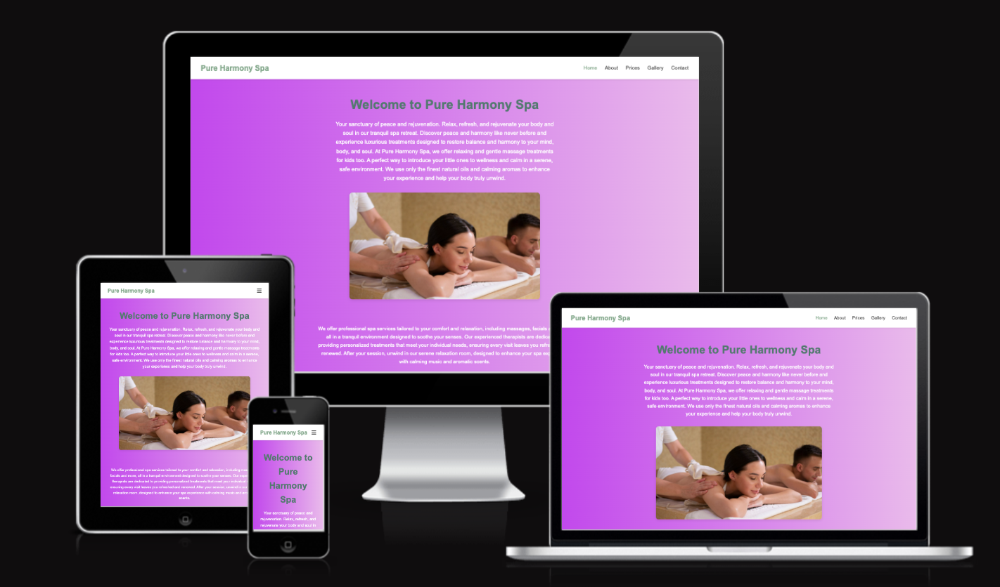

# Pure Harmony Spa 🌿

Welcome to Pure Harmony Spa — a modern, responsive spa website built with HTML, CSS, and a touch of JavaScript. It showcases various services offered at the spa, contact details, opening hours, and a beautiful layout designed for client relaxation and ease of use.

---

## 🚀 Live Demo

To view the website [Click here](https://ozi-cheri.github.io/pure-harmony-spa)

## 🛠️ Technologies Used

- HTML5
- CSS3
- Font Awesome (for social icons)
- Google Fonts (optional)

---

## 💆 Features

- Responsive design for desktop, tablet, and mobile
- Service pricing section
- Contact form (static only — not connected to backend yet)
- Opening hours
- Footer with social media links
- Clean, calming design with a focus on spa aesthetics

